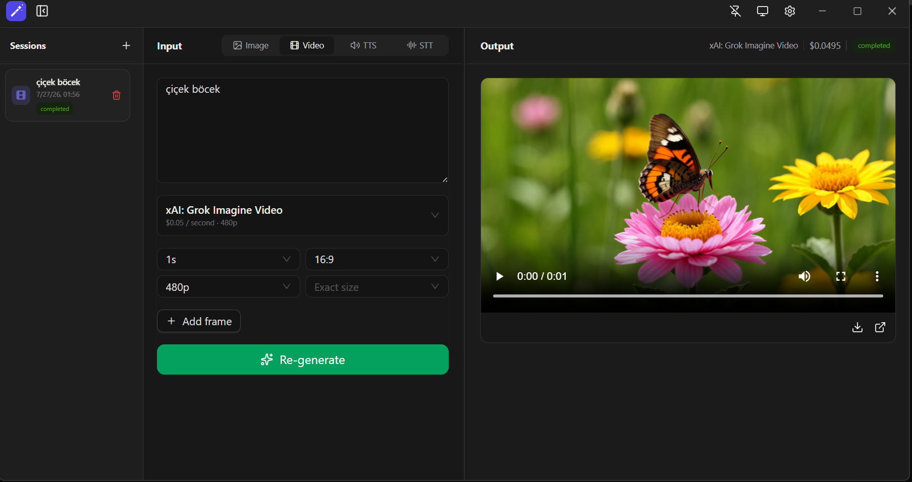
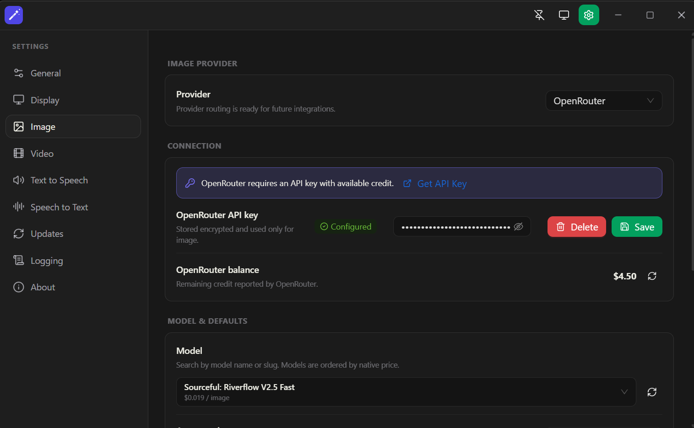

# AI Media Studio

AI Media Studio is an Electron desktop application for generating images, videos, speech, and transcriptions.




---

## Install

1. Download the latest release for your platform from [Releases](https://github.com/bariskisir/aimediastudio/releases/latest).
2. Install or extract the package.
3. Run **AIMediaStudio**.

## Development

```bash
git clone https://github.com/bariskisir/aimediastudio.git
cd aimediastudio
npm run dev
```

## License

MIT
